# uncharted dependencies

Identify dependencies in dotnet projects.

At the moment the tool lists all projects in the solutions it can find.

TODO:

* [ ] illustrate dependencies between projects

* [ ] support nuget and paket depdendencies

* [ ] illustrate dotnet versions

## usage

Simply copy & paste your entire repository in the "ScannedCode" directory and run the application.

## build

```
./build.sh
```

## run

```
./run.sh
```

## sample output

Names of solutions and projects are scrambled, the diagram is attached just to illustrate the final result.

```mermaid
---
title: dependencies
---
stateDiagram-v2
direction lr
state "0562ee6e-a985-4e18-aa2e-f2c6b7ad8bcf" as 6b7a3e21d27847d29d41032234ea15c9
state "6986fed5-622c-4ed3-b36a-60aed1edd794" as 6c6765a3c4954efbbdafb5701e7fb03e
state "cce330e7-b2b0-4758-b525-d5a1ab08b290" as 392eb92f68b04cdfa79545b0c7491b8a
state "8fd83e48-21a7-4a74-a81e-35c867c7b17a" as 8c9f1b5b97e441939486f80f49c75c7a
state "e4f05ec9-7e25-4740-8966-39b5e3abc7af" as b638891ec2004dc8b11ba7282f0735f5
state "6b9e631f-a2e5-4451-a0fe-b038703995e1" as 066cf0d5809f4bdea96d30b041ac4447
state "0f08d334-ab25-4777-a560-f82922bc85c5" as de1e3940abcf45e1a5b46f0484816ab5
state "fe2dc2f2-2283-4d1d-9623-4d0f6d458ee5" as d0856edb12904e6186a57b7048e49805
state "65a63957-63b5-4c7b-a5cc-682eae059374" as 4a4c63f4cdb94e9aade5a3aaee57b5d8
state "c04cc76c-83a0-4b58-aac9-ba0d099bc7c5" as d23c2c7f299341c582b9ef6740762c4e
state "a1c42967-69ed-4c72-ba8b-36cf1dfe8fcc" as 76966105134b4548a39fe13c72edb5eb
state "a43ca2c0-97da-497d-ac9a-7dd2c6cf7e5a" as b4130d6312ba44ab816204dbcd233f6c
state "821b15dc-906a-426c-9cee-7351ef219a0d" as 1d9129a31407457c9479a6c6aa77100d
state "4f7a6b8d-2bcd-4177-b6fa-6eef625a5b1c" as bf611ac1a3f24ea484e727c5a98214cc
state "5172a806-0ce5-48c7-915c-2518b22443e5" as 82c1a183f3c74a319594e100ef07133b
state "58983bed-b6e9-48cc-a8bf-aa45b449a853" as 651cbacdab07465d8616393d7f77b9cc
state "ce212116-6bc2-4381-aea8-f55edf537d59" as 0284fa737eda4d10965b88a2fc2d763c
state "a588e828-2a76-4b9a-9816-a70a0362cb87" as 6247bb39ad16497abec16df238b9b5ea
state "f911af61-b0f9-4e08-bc7d-25d9213e13e2" as 6ec9d36493674040a18e36fd88f515b6
state "35985763-e8e5-4b2d-be50-772e14bd5c87" as 2ab7f1cc97c44d8ea81a02043a1b1ca9
state "64fbd7be-f480-436e-b605-604e70e1db9f" as cf355a278b11462183dab2d784772d0b
state "f54fae67-81d5-4a63-ab04-bbd9f6ee44f8" as 8a5c59d2505c45968bbe521629a928f3
state "6807e63b-b4e9-4e85-a75c-48030976eb38" as 5ced3b5e24844ecab82b6cff613ec01a
state "9498a798-8898-445f-bfa6-93bdd06a5940" as 1fd0015af13c47e2867a9754bd355979
state "4729cf40-467a-49e3-aec3-cc33e6b0ecc0" as 93b4a33e4b424ff6ade1ee9f95214a4f
state "25106d4f-8ffb-4745-9194-73040a5a1fae" as 5e49007d12f24cc6a5aab14f989e4d26
state "44e8b1e1-a873-4ccb-8dc9-cc97644bbb0d" as 1c09ea892e2f4f00aea0f8c712234612
state "e4a5e101-7ae4-4a76-bf69-e0a1eaaa3ab9" as 3b78d9a4e5a84722a1e951c7c5d2a2a9
state "1f0fcfcb-9ffa-4ca5-9bf9-72eb31c354fd" as 356ee83466b6458abcdf015b90ec1f58
state "fc1e1b53-6b44-4ef7-8b95-a0c2483d92d8" as ec55830426914097ade6a7d945827bbe
state "da839176-4728-40bc-bee3-1aa035109ecb" as e290edbb46c14d7194bd845b22f2ac62
state "e293a34f-53f7-4bbd-a1ff-ea65e2ed5a40" as fa911ab7d0ff44eb9fdb4ce32ed1679d
state "08d14831-f1fe-43f7-834e-2d3e7785a234" as 41f1eb3e913d4c869a9cff0739c3d28a
state "417c37f9-0828-483a-8d27-d90d1c6a7e63" as 873d96881ee7405eb7e771a1f94754ff
state "559962b3-bd82-4f42-b036-01b0ab198d75" as 7e2d5998f9f44269ab21cc8b05d12559
state "9f2e2d15-9ee1-4ac9-b55e-37f286516b09" as 55792b53fb5046e4898335b7d2fe6f83
state "fa22e48d-7481-4b3f-a5ce-0d7287c6c4e7" as 4cbba358c1054249a3b5d779b7e4c89d
state "788b5ddd-da41-4489-bed6-1c7546d0be53" as 2603d7b423544a44b27f72e4a4476fe5
state "3951b34e-33a8-4cb7-a6d5-6c1a5458ccdc" as 1b77538e20cf43f8b4044af3405aad2a
state "245e9d68-ba53-4fc5-aff6-8e09eaeee5e9" as 88bd20a9ff8b4305b808680e91ef96da
state "de539599-34b3-47ad-b5dd-d9cccba2023c" as 7b5555e70a634c409fe9bbda3dad94f5
state "34e5f145-5073-4a61-8bb4-221fba6f2ee5" as 753e5949bf9c420885cf5a4de49bebbb
state "370cbe4b-3d52-4c45-bc83-cf6bca805b0c" as 27138f9658ad42309f8f9c3d52aebb6f
state "82522581-bd93-4bca-98af-2ecb53e40e38" as d8abb7f5fbec4651a59474005ad26038
state "13cd785f-bd14-4460-807f-d6c99843c001" as d8755dd5222a494491032f70c5240d16
state "ca4febe3-b85f-4870-9ceb-9e92be6b0984" as 0ce447025dfd468c91767c5c8ab9cbe8
state "35c98e81-98ac-41e9-85c3-78512a58f41b" as fb45f93c636844d093c94c2d9ddf8de5
state "b8b12f03-bccb-4132-888c-b78ab657fe6f" as 87ad33b7fb304096ac8fb913cd5c6e22
state "6a4a2a34-12ec-45dc-bb13-c627be796d56" as 6e5c853ad8804fcc9fd3bdbf22c2ba85
state "c64c337b-4d34-4367-a322-c888825e406c" as 3c35721cac7d40ae9c94733104b75760
state "74a0b87a-0430-4a4b-a26c-2fbfe4e3ea5e" as 5135e02d4d5e4a9a9e9d74277ae43d4a
state "d27126df-7455-41cb-8af9-60c4a3e2e320" as 337d1ef86ebd4d8ca51f05bd4367b627
[*] --> 6b7a3e21d27847d29d41032234ea15c9
6b7a3e21d27847d29d41032234ea15c9 --> 6c6765a3c4954efbbdafb5701e7fb03e
6b7a3e21d27847d29d41032234ea15c9 --> 392eb92f68b04cdfa79545b0c7491b8a
6b7a3e21d27847d29d41032234ea15c9 --> 8c9f1b5b97e441939486f80f49c75c7a
6b7a3e21d27847d29d41032234ea15c9 --> b638891ec2004dc8b11ba7282f0735f5
6b7a3e21d27847d29d41032234ea15c9 --> 066cf0d5809f4bdea96d30b041ac4447
6b7a3e21d27847d29d41032234ea15c9 --> de1e3940abcf45e1a5b46f0484816ab5
6b7a3e21d27847d29d41032234ea15c9 --> d0856edb12904e6186a57b7048e49805
6b7a3e21d27847d29d41032234ea15c9 --> 4a4c63f4cdb94e9aade5a3aaee57b5d8
6b7a3e21d27847d29d41032234ea15c9 --> d23c2c7f299341c582b9ef6740762c4e
6b7a3e21d27847d29d41032234ea15c9 --> 76966105134b4548a39fe13c72edb5eb
6b7a3e21d27847d29d41032234ea15c9 --> b4130d6312ba44ab816204dbcd233f6c
6b7a3e21d27847d29d41032234ea15c9 --> 1d9129a31407457c9479a6c6aa77100d
6b7a3e21d27847d29d41032234ea15c9 --> bf611ac1a3f24ea484e727c5a98214cc
6b7a3e21d27847d29d41032234ea15c9 --> 82c1a183f3c74a319594e100ef07133b
6b7a3e21d27847d29d41032234ea15c9 --> 651cbacdab07465d8616393d7f77b9cc
6b7a3e21d27847d29d41032234ea15c9 --> 0284fa737eda4d10965b88a2fc2d763c
6b7a3e21d27847d29d41032234ea15c9 --> 6247bb39ad16497abec16df238b9b5ea
6b7a3e21d27847d29d41032234ea15c9 --> 6ec9d36493674040a18e36fd88f515b6
6b7a3e21d27847d29d41032234ea15c9 --> 2ab7f1cc97c44d8ea81a02043a1b1ca9
6b7a3e21d27847d29d41032234ea15c9 --> cf355a278b11462183dab2d784772d0b
6b7a3e21d27847d29d41032234ea15c9 --> 8a5c59d2505c45968bbe521629a928f3
6b7a3e21d27847d29d41032234ea15c9 --> 5ced3b5e24844ecab82b6cff613ec01a
6b7a3e21d27847d29d41032234ea15c9 --> 1fd0015af13c47e2867a9754bd355979
6b7a3e21d27847d29d41032234ea15c9 --> 93b4a33e4b424ff6ade1ee9f95214a4f
6b7a3e21d27847d29d41032234ea15c9 --> 5e49007d12f24cc6a5aab14f989e4d26
6b7a3e21d27847d29d41032234ea15c9 --> 1c09ea892e2f4f00aea0f8c712234612
6b7a3e21d27847d29d41032234ea15c9 --> 3b78d9a4e5a84722a1e951c7c5d2a2a9
6b7a3e21d27847d29d41032234ea15c9 --> 356ee83466b6458abcdf015b90ec1f58
6b7a3e21d27847d29d41032234ea15c9 --> ec55830426914097ade6a7d945827bbe
6b7a3e21d27847d29d41032234ea15c9 --> e290edbb46c14d7194bd845b22f2ac62
6b7a3e21d27847d29d41032234ea15c9 --> fa911ab7d0ff44eb9fdb4ce32ed1679d
6b7a3e21d27847d29d41032234ea15c9 --> 41f1eb3e913d4c869a9cff0739c3d28a
6b7a3e21d27847d29d41032234ea15c9 --> 873d96881ee7405eb7e771a1f94754ff
6b7a3e21d27847d29d41032234ea15c9 --> 7e2d5998f9f44269ab21cc8b05d12559
6b7a3e21d27847d29d41032234ea15c9 --> 55792b53fb5046e4898335b7d2fe6f83
6b7a3e21d27847d29d41032234ea15c9 --> 4cbba358c1054249a3b5d779b7e4c89d
6b7a3e21d27847d29d41032234ea15c9 --> 2603d7b423544a44b27f72e4a4476fe5
6b7a3e21d27847d29d41032234ea15c9 --> 1b77538e20cf43f8b4044af3405aad2a
6b7a3e21d27847d29d41032234ea15c9 --> 88bd20a9ff8b4305b808680e91ef96da
6b7a3e21d27847d29d41032234ea15c9 --> 7b5555e70a634c409fe9bbda3dad94f5
6b7a3e21d27847d29d41032234ea15c9 --> 753e5949bf9c420885cf5a4de49bebbb
6b7a3e21d27847d29d41032234ea15c9 --> 27138f9658ad42309f8f9c3d52aebb6f
6b7a3e21d27847d29d41032234ea15c9 --> d8abb7f5fbec4651a59474005ad26038
6b7a3e21d27847d29d41032234ea15c9 --> d8755dd5222a494491032f70c5240d16
6b7a3e21d27847d29d41032234ea15c9 --> 0ce447025dfd468c91767c5c8ab9cbe8
6b7a3e21d27847d29d41032234ea15c9 --> fb45f93c636844d093c94c2d9ddf8de5
6b7a3e21d27847d29d41032234ea15c9 --> 87ad33b7fb304096ac8fb913cd5c6e22
6b7a3e21d27847d29d41032234ea15c9 --> 6e5c853ad8804fcc9fd3bdbf22c2ba85
6b7a3e21d27847d29d41032234ea15c9 --> 3c35721cac7d40ae9c94733104b75760
6b7a3e21d27847d29d41032234ea15c9 --> 5135e02d4d5e4a9a9e9d74277ae43d4a
6b7a3e21d27847d29d41032234ea15c9 --> 337d1ef86ebd4d8ca51f05bd4367b627
```

